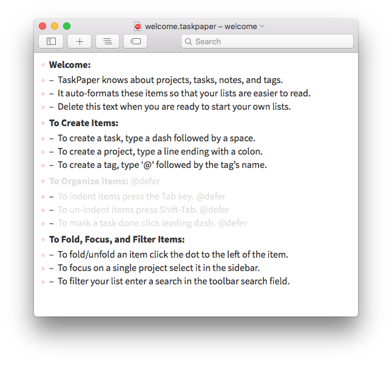

# Auto-expiring deferred items

Sometimes I want to add an item to my task list, but I don't want to act
on it immediately.  Perhaps it's blocked on another task, or I can't start
doing it until a certain date.  I use the `@defer` tag to label such items.

I have a few lines in my [TaskPaper theme][theming] that dim deferred items,
so they're easy to skip when I'm skimming my task list:

```less
item[data-defer],
run[tag=data-defer] {
  color: #ddd;
}
```

This is what that looks like:



If I want to defer items to a particular date, I tag them with
`@defer(YYYY-MM-DD)`.  What I'd like to do is automatically remove those defer
tags when they expire.

I can do this with python-taskpaper:

```python
#!/usr/bin/env python
# -*- encoding: utf-8 -*-

from datetime import datetime
from taskpaper import TaskPaperDocument

# Get today's date
today = datetime.today().date()

# Get the TaskPaper document.  We can use this class as a context manager:
# any changes we may will be written when we exit the 'with' block.
with TaskPaperDocument('welcome.taskpaper') as document:

    # Go through all the items in the document
    for item in document.items:

        # Go through every tag on each item
        for tag in item.tags:

            # If the tag isn't a defer tag, we can skip it
            if tag.name != 'defer':
                continue

            # If the tag is a defer tag, and it's today's date or earlier,
            # we should remove it
            if datetime.strptime(tag.value, '%Y-%m-%d').date() <= today:
                item.remove_tag(*tag)
```

I have this set to run as a [Keyboard Maestro job][kmaestro] at 2am every
morning.  Any deferred tasks that I need to deal with that day are already back on my task list before I wake up.

[theming]: http://guide.taskpaper.com/creating_themes.html
[kmaestro]: https://www.keyboardmaestro.com